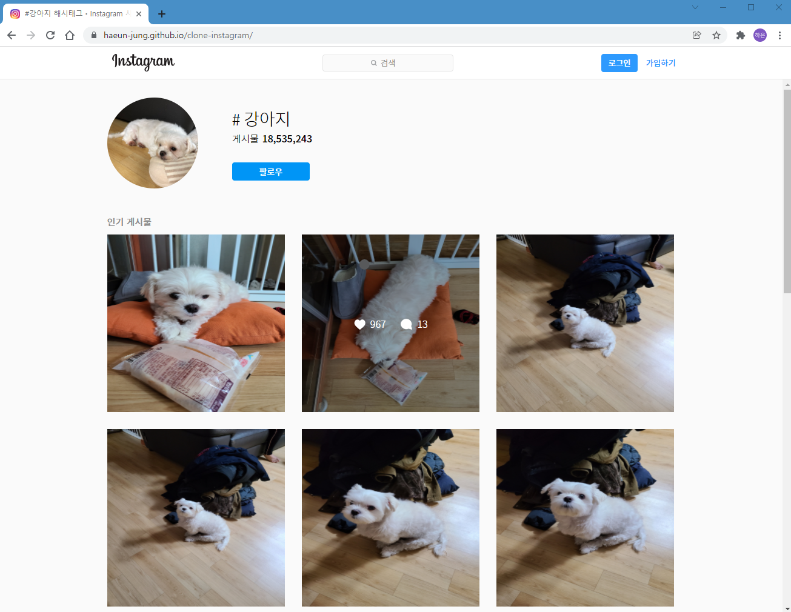
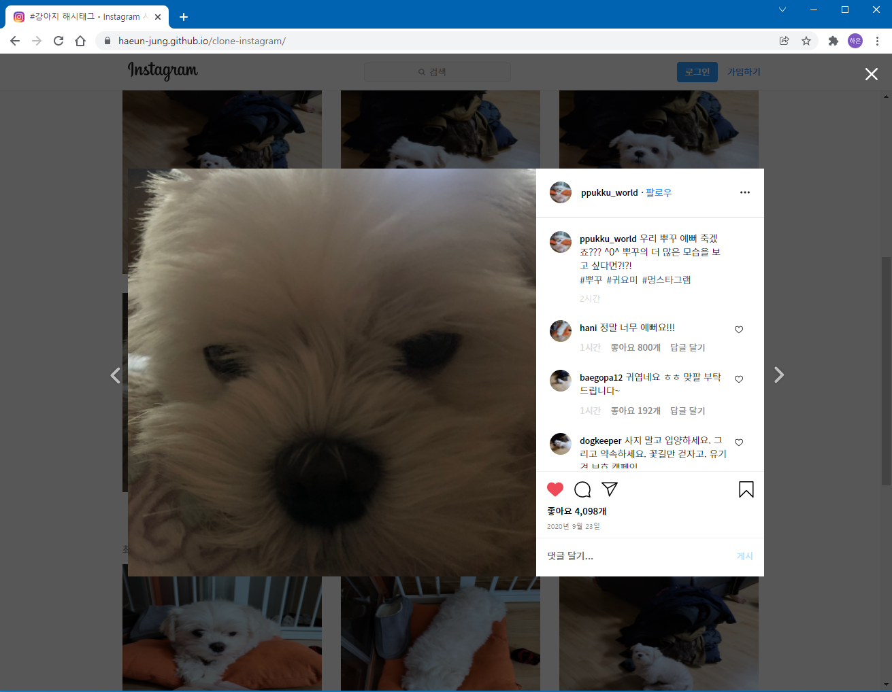
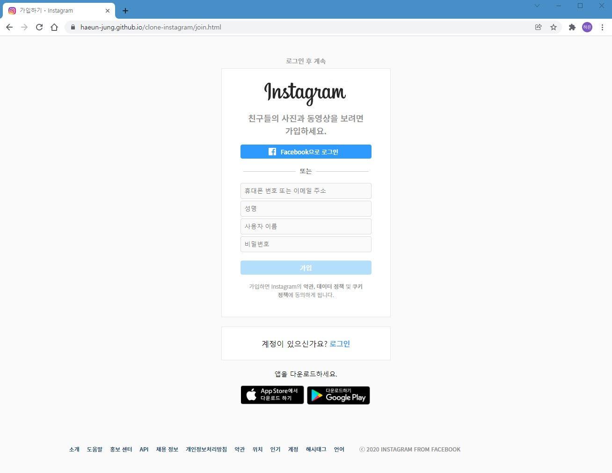
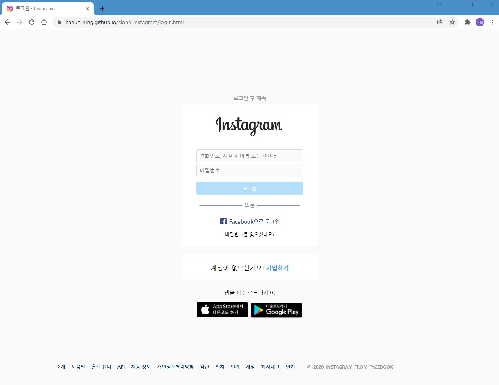
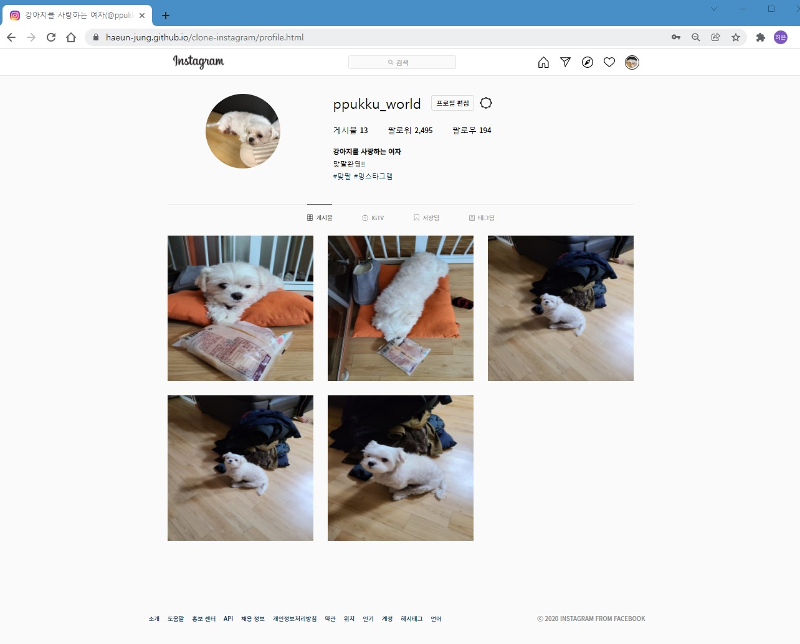
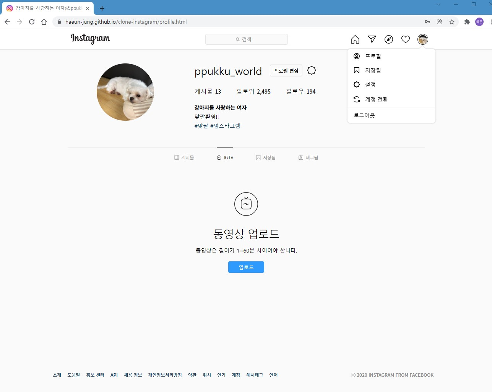

# 클론 인스타그램

> 2020.09 - 2020.11  
> **Frontend Project**   
> **클론 대상 : [인스타그램](https://www.instagram.com/explore/tags/%EA%B0%95%EC%95%84%EC%A7%80/)**

👉 [구경하기](https://haeun-jung.github.io/clone-instagram/)

 

## 1️⃣ 소개

'**인스타그램**'을 모티브로 클론 코딩을 진행하였습니다. 포스트 및 내 프로필 확인, 로그인과 회원가입을 진행할 수 있습니다. 지인이 node.js로 구축 서버로 다양한 포스트를 가져옵니다.

 

## 2️⃣ 주요 기능 및 화면

- **메인**
  - 포스트에 cursor를 focus하면 좋아요 수와 댓글 수가 보입니다.
  - 포스트 목록을 스크롤하여 한 번에 확인 가능합니다.  
  - 스크롤을 끝까지 내렸다면, 다음 포스트들이 로딩됩니다.

 

- **포스트**
  - 사진 클릭 시 게시글을 볼 수 있습니다.
  - 사이드에 위치한 화살표를 누르면 이전/다음 게시글로 넘어갑니다.
  - 하트 클릭과 팝업이 구현되어 있습니다.
  - 댓글 영역은 스크롤이 가능합니다.

 

- **회원가입 및 로그인**
  - 회원가입 및 로그인을 통해 프로필 페이지에 진입합니다.
  - 비밀번호를 8글자 이상 입력 시 회원가입과 로그인을 진행할 수 있습니다.
  - input에 입력값을 넣으면 (회원가입/로그인)버튼의 색이 변경됩니다.

 

- **프로필**
  - 로그인이 완료되면 프로필 화면으로 넘어갑니다.
  - 각종 팝업과 화면 전환이 구현되어 있습니다.

 

## 3️⃣ 사용 기술

-   **html**
-   **sass**
-   **javascript**
-   **REST API 통신 구현**

 

## 4️⃣ 어려움 해결 과정

ios에서 페이지가 일부 깨지는 이슈가 발생하였습니다. 정확한 원인을 찾기 위해 CSS 프로퍼티를 하나씩 검색하였고, 프로퍼티에 따라 운영체제에 작동되는 방식이 다른지 분석하였습니다. 가운데 정렬을 위해 사용했던 display: flex와 flex-direction: column 속성이 부모 자식 간에 연달아 나와 ios 화면이 정상적으로 보이지 않는다는 것을 깨달았습니다. 해당 속성을 제거하고 상하 margin은 0으로, 좌우 margin을 auto로 지정하여 가운데 정렬을 해결하였습니다.

 

## 5️⃣ 느낀 점

처음 진행하였던 개인 프론트엔드 프로젝트로 반복되는 코드가 존재합니다. 실제 인스타그램 서비스와 최대한 비슷한 결과물을 산출해 내기 위해 노력하였고, REST API 통신도 직접 구현해 보며 프론트엔드 역량을 키울 수 있었습니다. 또한 SASS로 디자인 요소를 더욱 가독성 있게 작성하였고, Vanilla Javascript로 사용하여 Javascript의 기본기를 다지고 다양한 특징을 배울 수 있었습니다.

 
