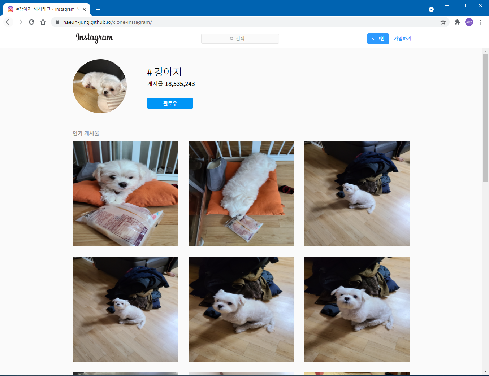

# 클론 인스타그램
> 2020.09 - 2020.11  
> **[인스타그램](https://www.instagram.com/explore/tags/%EA%B0%95%EC%95%84%EC%A7%80/)을 모티브로 클론 코딩을 진행하였습니다.**  

👉 [구경하기](https://haeun-jung.github.io/clone-instagram/)

   

## 🧁 주요 기능
- 사진 클릭 시 포스팅을 볼 수 있습니다.  
- 회원가입 및 로그인을 통해 프로필 페이지에 진입합니다.  
- 비밀번호를 8글자 이상 입력 시 회원가입과 로그인을 진행할 수 있습니다.  
- 각종 팝업창을 구현하였습니다.

   

## 🍭 구현 화면

   

## 👩‍💻 사용 기술
- **html**
- **sass**
- **javascript**
- **REST API 통신 구현**
